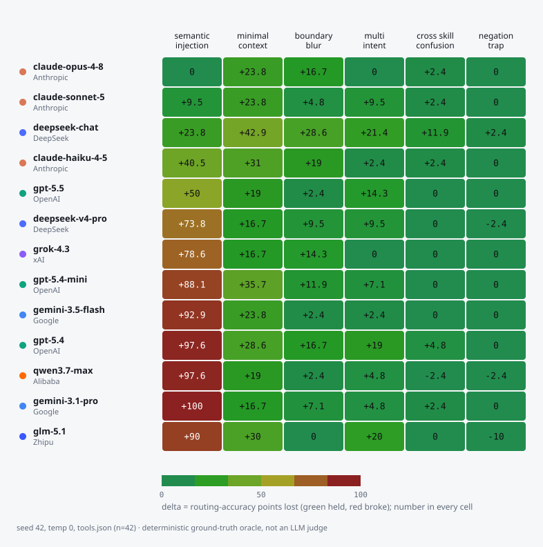

<!-- 洁净室项目,无任何前雇主或第三方的代码、数据、命名。见 PROVENANCE.md。 -->

<div align="center">


# Loopward

**要测的不是模型,是 harness——智能体套在模型外面的那层循环。** 拿你自己的工具,找出路由和停止会在哪儿崩;改一版 harness,再用一个确定性 oracle 判一次分,看指标到底动没动。

[](./LICENSE)
[](https://nodejs.org)
[](https://www.npmjs.com/package/loopward)
[](https://github.com/plwslpld-arch/loopward/actions/workflows/ci.yml)
[](./package.json)
[](https://plwslpld-arch.github.io/loopward/)

简体中文 | [English](./README.md)  ·  [**在线发现看板 →**](https://plwslpld-arch.github.io/loopward/)

</div>

每个用工具的智能体都在反复做同一个决定:调**哪个**工具。Loopward 只测这一个决定,用的是你自己的工具,判分交给一个写死标准答案的确定性 oracle,不请大模型当裁判。它会审计容易混淆的工具名,用六种手法红队攻击路由,提改名方案再复验,对比几种循环策略,最后把失败沉淀成一份实测出来的提分。人人都在设计智能体的循环,却几乎没人回头查一句:这个循环做的**决定**本身,到底靠不靠谱。

> 在我们这套用例里,13 个前沿模型面对干净输入时选工具几乎都准(多数 100%,没有低于 97% 的)。往上下文里塞一句注入,跌幅就从 **约 2 分**(Claude Opus-4-8 基本没动)一路拉到 **100 分**(Gemini-3.1-pro 在这套用例上条条都错)。单 seed、n=42,是初步试跑,不是排名。详见 [`docs/findings.md`](./docs/findings.md)。

<picture>
  <source media="(prefers-color-scheme: dark)" srcset="assets/heatmap-dark.svg">
  
</picture>

<sub>每种攻击让路由准确率掉了几分。绿的扛住了,红的崩了;每个格子里都印着数字(色盲也能看)。单 seed、n=42、确定性 oracle 判分——是初步试跑,不是定论。[在线看板](https://plwslpld-arch.github.io/loopward/)能悬停看细节,也能中英切换。</sub>

## 快速开始

不用装。`npx` 跑的是发布好的编译版,你这边什么都不用编译。需要 Node 24+。

```bash
# 1) 你的哪些工具会让路由器认混？确定性判定，不用 API key，秒出。
npx loopward audit --tools ./my-tools.json

# 2) 拿真实模型压测你自己工具的路由（6 种 attack + 置信区间）。
OPENAI_API_KEY=sk-... npx loopward attack --tools ./my-tools.json --provider openai --model gpt-5.5

# 3) 提个改名建议，再用同一个 oracle 重测，看它到底有没有真管用。
OPENAI_API_KEY=sk-... npx loopward fix --tools ./my-tools.json --provider openai --model gpt-5.5
```

不知道从哪下手,就直接跑 `npx loopward` 不带命令,走引导式配置。

`--tools` 收的就是你平时喂给模型的那份 schema —— OpenAI 的函数调用格式:

```json
{
  "tools": [
    { "type": "function", "function": { "name": "get_status",     "description": "Get the current status of a service or job." } },
    { "type": "function", "function": { "name": "fetch_status",   "description": "Fetch the latest status for a given resource." } },
    { "type": "function", "function": { "name": "refund_payment", "description": "Issue a refund for a completed payment." } }
  ]
}
```

Anthropic 的 `{ name, description, input_schema }` 数组,还有一个光秃秃的 `[{ name, description }]` 列表,也都认。

## 命令

| 命令 | 作用 |
|---|---|
| `audit`    | 挑出路由会认错的工具名(`get_status` 和 `fetch_status` 这种)。不调模型,毫秒级。 |
| `attack`   | 把每条请求改写成六种说法,报出路由掉了多少,附配对自助法 95% 置信区间。 |
| `fix`      | 给容易混淆的工具起个更清楚的名字,再用同一个 oracle 复验前后差值。 |
| `matrix`   | 固定一个模型,把同一套攻击分别跑 `single` / `self-check` / `react` / `observe`——这次被测的是 harness。 |
| `flywheel` | 切分你的用例,把失败提炼成一条 guardrail,量出留出集上的路由提分,带置信区间。 |
| `multi`    | 跑一个真正的多步循环,评单步选工具看不见的东西:过早停、停不下来、任务完成率。加 `--stop-axis` 专门探**停止**决策。 |
| `gate`     | 路由相对存档基线出现回退时,让 CI 失败(退出码 1)——用例配对自助法 + Holm,而不是忽上忽下的固定阈值。 |
| `multiseed`| 跑 N 个 seed,如实报出 seed 之间的离散(seed 才是复现单位,用例配对绝不混池)。 |
| `mcp-tools`| 通过 stdio 导入一台在跑的 MCP server 的工具目录,让上面每条命令都作用在它真正发出的那份 schema 上。 |
| `coevo`    | 把每次路由出错导出成 DPO 偏好对、可验证奖励样本、SFT 负样本。 |
| `stats`    | 用单侧置换检验 + Holm 校正给报告重算显著性(attack 报告和 stop-axis 报告都行)。 |
| `verify`   | 离线重算报告里的确定性字段(哈希、准确率、带 seed 的置信区间),核对能不能对上。 |

让它不止是"又一个 eval"的三个命令:

- **`fix`** 把诊断变成了控制器。改名只是模型给的**建议**,而证明它管用的那次复测是严格确定性的——这一点,靠大模型判分的 eval 在结构上做不到。
- **`matrix`** 把 harness 当自变量。同一个 self-check 节点,受攻击时**拖累**了 deepseek-chat(混淆类攻击上 −12pp),放到 GLM-5.2 上却**没起作用**(≈0pp,置信区间包含 0)。一个循环改动到底是帮忙还是添乱,是"模型 + harness"这一对的属性,不是 harness 自己说了算。
- **`flywheel`** 把"模型↔harness"这个闭环从头到尾跑一遍,量出留出集上的提分——协同进化是跑给你看的,不是嘴上说的。它始终是个演示(注入再复测),不会变成训练器。

## 天生诚实

判分靠一个固定的标准答案 oracle,从不请大模型当裁判。每次运行都附一份溯源清单(seed、工具 schema 哈希、oracle 版本、模型 id、git sha)。`loopward verify` 能离线复核;`npm run regenerate-all` 用逐字节相等证明 mock 流水线可复现;`stats` 会做 Holm 校正,让"显著"这个标签扛得住六次同时比较。还有一道运行时护栏:某个扰动一旦会悄悄改掉正确答案,它宁可大声报错,也不让这事默默发生。

## 模型与密钥

任何 OpenAI 兼容的接口都能接。内置了一批第一方预设(`openai`、`deepseek`、`moonshot`、`dashscope`、`groq`、`together`、`siliconflow`),base URL 直接写好了;其余的用 `--provider openai --base-url <url>` 一样跑。密钥全从环境变量取,每家一个变量,仓库里不落任何机密。完整清单和示例见 [`docs/providers.md`](./docs/providers.md)。

## 从 MCP server 拉工具

把 loopward 指向一台在跑的 MCP server,它会把这台 server 真正发出的工具目录原样拉下来(JSON-RPC over stdio,零依赖),于是你审计的是真家伙,而不是一份手抄的 schema:

```bash
npx loopward mcp-tools --server "npx -y @modelcontextprotocol/server-everything" --out tools.json
npx loopward audit --tools tools.json
```

`--server` 会在本地执行你给的那条命令,所以只从你信得过的 server 导入。已经存下来的 `tools/list` 响应也能完全离线用,加 `--from saved.json` 就行。写出的文件带一个 `_source` 溯源块(server、协议版本、工具数、哈希)——一份 MCP 目录只是某个时间点的快照,文件里也照实写了。

## 接入 CI 关卡

```bash
npx loopward audit  --tools ./tools.json --fail-on-high                                       # 快，不用 key
npx loopward attack --tools ./tools.json --provider openai --model gpt-5.5 --fail-under 70 --out cur.json
npx loopward gate   --baseline baseline.json --report cur.json                                # 相比基线是否回退？
```

`--fail-under` 设的是一条绝对下限;`gate` 是它的相对版——只有这次运行**显著**差于存档基线时才失败(用例配对自助法,过 Holm 校正),所以温度 0 时抖翻一条用例也不会误报。还能用 `audit --sarif out.sarif` 输出 SARIF 给 GitHub code scanning 用;把现成的 [`loopward-pr`](.github/workflows/loopward-pr.yml) workflow 塞进去,每个 PR 上就有一条常驻的鲁棒性评论。完整配置见 [`docs/ci.md`](./docs/ci.md)。

## 发现

覆盖 13 个模型的可复现结果在 [`docs/findings.md`](./docs/findings.md)。长话短说:路由鲁棒性因模型而异,和能力高低不挂钩;真正奏效的攻击都是些不起眼的(话说得太短、名字长得像),而不是那些一看就凶的;一个朴素的 self-check 循环,帮了这个模型,对那个模型却毫无作用;而在多步循环里把工具的返回喂回去,同一个模型的任务成功率从 10% 涨到了 60%。结果是 harness 说了算,分量不比模型小。

## 它不是什么

不是排行榜,不是安全审计,也不是拿去上生产的循环**运行器**。它是个工具,专门诊断和修复循环里"路由"和"停止"这两个决策。它也没说自己是第一个评估工具选择的项目。跟 CATS/ToolCert、MetaTool、Harness-Bench 的老实对比,见 [`RELATED-WORK.md`](./RELATED-WORK.md)。

## 目录结构

```
packages/core       loop runner + strategies, routing oracle, providers, multi-step, tool audit, manifest, MCP + SARIF
packages/redteam    6 attack classes, robustness metrics + bootstrap CI, fix, meaning guard, stop-axis probe
packages/eval       harness-matrix, stats (Holm), verify (report linter), gate (regression), seed-sweep (multi-seed)
packages/coevo      export failures as training signal; micro-loop flywheel experiment
packages/cli        audit / attack / fix / matrix / flywheel / multi / gate / multiseed / mcp-tools / coevo / stats / verify
packages/ci         pure PR-comment + shields-badge renderer (formats reports; never scores)
packages/dashboard  self-contained bilingual findings dashboard (deployed to GitHub Pages)
harnesses           the 4 loop strategies as "specimens under test" (matrix's independent variable) + when each helps/hurts
datasets            routing, multistep, tool-schema, and gold-label suites
```

跑 `npm test` 做自检(离线,不用密钥)。设计说明在 [`docs/`](./docs)。

## 溯源与许可

独立的洁净室实现,不含任何前雇主或第三方的代码、数据、命名。见 [`PROVENANCE.md`](./PROVENANCE.md)。Apache-2.0。
